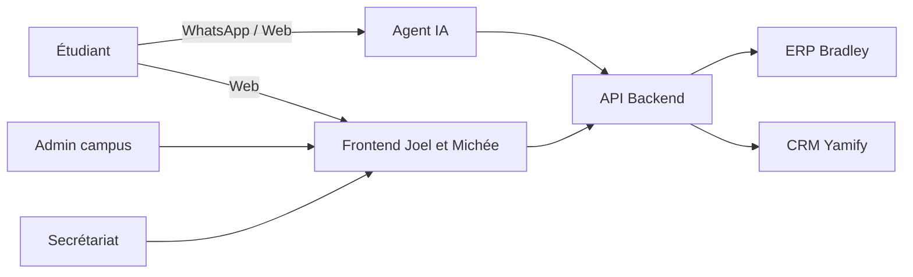
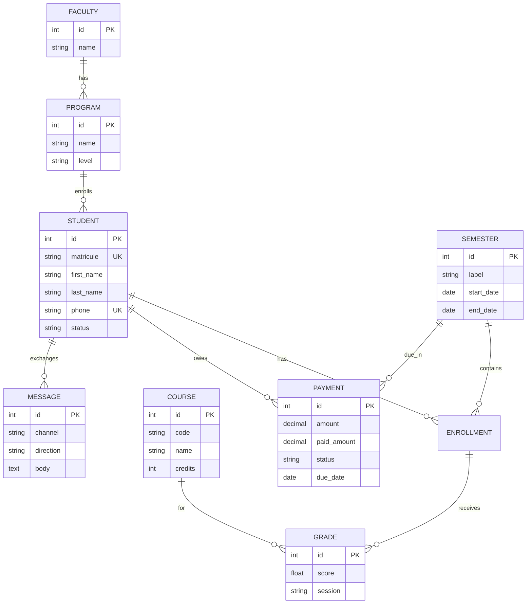
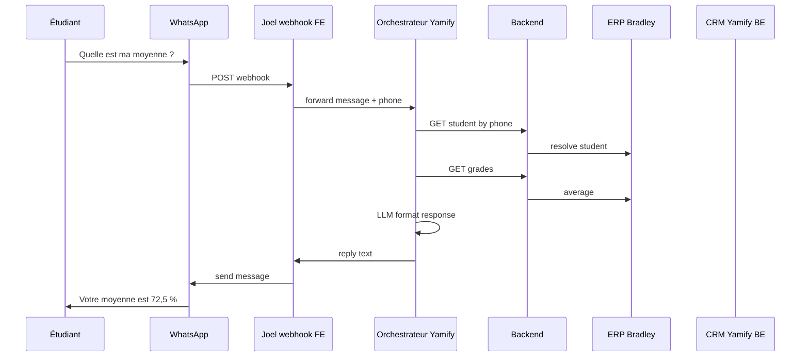

# Plan de conception — SmartCampus AgentAI

**Références :** [PROJET.md](./PROJET.md) · [Documentation.md](./Documentation.md)  
**Contexte :** Hackathon OpenClaw · Yamify (cloud souverain, Kinshasa)  
**Version :** 1.0 — mai 2026

---

## Table des matières

1. [Synthèse et périmètre](#1-synthèse-et-périmètre)
2. [Acteurs et rôles](#2-acteurs-et-rôles)
3. [Architecture technique](#3-architecture-technique)
4. [Modèle de données (MVP)](#4-modèle-de-données-mvp)
5. [Modules fonctionnels](#5-modules-fonctionnels)
6. [Contrats d’API inter-modules](#6-contrats-dapi-inter-modules)
7. [Agent IA et système multi-agents](#7-agent-ia-et-système-multi-agents)
8. [Sécurité et souveraineté](#8-sécurité-et-souveraineté)
9. [Interfaces utilisateur](#9-interfaces-utilisateur)
10. [Parcours et cas d’utilisation](#10-parcours-et-cas-dutilisation)
11. [Plan de réalisation (hackathon)](#11-plan-de-réalisation-hackathon)
12. [Critères d’acceptation — démo jury](#12-critères-dacceptation--démo-jury)
13. [Roadmap post-hackathon](#13-roadmap-post-hackathon)
14. [Risques et mitigations](#14-risques-et-mitigations)

---

## 1. Synthèse et périmètre

### 1.1 Vision produit

**SmartCampus AgentAI** est une plateforme universitaire qui fusionne :

| Pilier | Backend | Frontend |
|--------|---------|----------|
| ERP académique | **Bradley** — API, modèles, notes | **Joel** — `students.html`, `grades.html`, JS ERP |
| CRM campus | **Yamify** — API paiements, relances | **Michée** — `payments.html`, `communications.html` |
| Agent IA autonome | **Yamify** — orchestration, intents, OpenClaw | **Joel** — `demo/chat.html`, simulateur WhatsApp |

### 1.2 Objectifs (alignés documentation)

| Niveau | Objectif |
|--------|----------|
| **Général** | Centraliser gestion universitaire, communication et assistance IA 24h/24 |
| **Hackathon** | Prouver un parcours bout-en-bout : impayé → CRM → question WhatsApp → réponse agent |
| **Stratégique** | Données hébergées localement (souveraineté · Kinshasa / OADC Texaf) |

### 1.3 Périmètre MVP vs vision complète

La [Documentation.md](./Documentation.md) décrit une vision large (résumé PDF, assistant programmation, multi-agents complets). **Pour le hackathon, on fige le MVP** :

| Inclus MVP | Reporté post-hackathon |
|------------|------------------------|
| 1 faculté, 1 promo, 1 semestre, 2–3 UE | Multi-facultés, jury, diplômes |
| CRUD étudiant + notes + inscription | Présences, bulletins PDF avancés |
| Paiements + statut impayé + relance mock | Mobile Money production |
| 3–5 intents agent (notes, frais, dates, statut) | Résumé PDF, coding agent, planification |
| Dashboard admin + vue étudiant minimale | App mobile native, analytics prédictifs |
| WhatsApp **ou** simulateur SMS | Telegram, reconnaissance vocale |

---

## 2. Acteurs et rôles

### 2.1 Personas



| Acteur | Besoins principaux | Canaux |
|--------|-------------------|--------|
| **Étudiant** | Notes, frais, horaires, statut inscription | WhatsApp/SMS, dashboard |
| **Admin / secrétariat** | Impayés, inscriptions, annonces | Dashboard admin |
| **Enseignant** *(phase 2)* | Saisie notes, classes | Dashboard enseignant |
| **Parents / tuteurs** *(option)* | Visibilité paiements | SMS, portail léger |

### 2.2 Matrice responsabilités (équipe)

| Livrable | Bradley (BE) | Yamify (BE) | Michée (FE) | Joel (FE) |
|----------|--------------|-------------|-------------|-----------|
| Schéma BDD + API ERP | ● | ○ | | ○ |
| Schéma BDD + API CRM | ○ | ● | | ○ |
| Agent IA + déploiement | | ● | | ○ |
| Pages ERP (HTML/JS) | | | ○ | ● |
| Pages CRM (HTML/JS) | | | ● | ○ |
| Shell app, `api.js`, login | | | ○ | ● |
| Simulateur WhatsApp | | ○ | | ● |
| Script démo 3 min | ○ | ○ | ○ | ● |

● = responsable · ○ = contributeur · **BE** = backend · **FE** = frontend

---

## 3. Architecture technique

### 3.1 Vue globale

```
┌──────────────────────────────────────────────────────────────────┐
│                        CANAUX UTILISATEUR                         │
│   Frontend Web (Joel + Michée)   WhatsApp / SMS (FE Joel · BE Yamify) │
└────────────────────────────┬─────────────────────────────────────┘
                             │
                             ▼
┌──────────────────────────────────────────────────────────────────┐
│                     API GATEWAY / BACKEND                         │
│              Python · FastAPI (recommandé hackathon)              │
│         Auth JWT · routage · agrégation ERP + CRM               │
└───────┬──────────────────────┬──────────────────────┬────────────┘
        │                      │                      │
        ▼                      ▼                      ▼
┌───────────────┐    ┌───────────────┐    ┌───────────────────────┐
│  MODULE ERP   │    │  MODULE CRM   │    │   ORCHESTRATEUR IA    │
│   (Bradley)   │◄──►│   (Yamify)    │◄──►│      (Yamify)         │
│  /api/erp/*   │    │  /api/crm/*   │    │  OpenClaw · LangChain │
└───────┬───────┘    └───────┬───────┘    └───────────┬───────────┘
        │                    │                        │
        └────────────────────┼────────────────────────┘
                             ▼
                    ┌─────────────────┐
                    │   PostgreSQL    │
                    │  (ou SQLite MVP) │
                    └────────┬────────┘
                             ▼
                    ┌─────────────────┐
                    │  Yamify / Cloud │
                    │  local Kinshasa │
                    └─────────────────┘
```

### 3.2 Stack technique (décision conception)

| Couche | Choix | Alternative hackathon |
|--------|-------|------------------------|
| Frontend | **HTML5, CSS3, JavaScript vanilla, Bootstrap 5** (pas React) | **Joel + Michée** — Joel : ERP + shell ; Michée : CRM |
| Backend | **Python + FastAPI** | Flask si préférence équipe |
| BDD | **PostgreSQL** (prod) / **SQLite** (dev rapide) | Une seule instance partagée |
| IA | OpenClaw, LangChain, API LLM locale ou souveraine | Pas d’appel cloud étranger en démo |
| Messaging | WhatsApp Business API **ou** webhook mock | Simulateur pour jury sans compte Meta |
| Hébergement | Yamify · infra locale Texaf | Docker compose sur machine hackathon |

### 3.3 Principes d’architecture

1. **Monolithe modulaire** — un repo, namespaces `/erp`, `/crm`, `/agent` (évite 3 déploiements en 48h).
2. **API-first** — le frontend (Joel, Michée) et l’agent ne lisent jamais la BDD directement ; tout passe par REST.
3. **Agent en lecture seule** sur données sensibles (MVP) ; écritures (relances) via endpoints CRM dédiés.
4. **Id étudiant unique** (`student_id` / matricule) — clé de liaison ERP ↔ CRM ↔ agent.

---

## 4. Modèle de données (MVP)

### 4.1 Diagramme entités (simplifié)



### 4.2 Tables ERP (Bradley)

| Table | Champs clés | Notes |
|-------|-------------|-------|
| `faculties` | id, name | 1 ligne seed « Faculté Sciences » |
| `programs` | id, faculty_id, name, level (L1, L2, Master) | |
| `students` | id, matricule, names, phone, program_id, status | status: `active`, `suspended`, `graduated` |
| `semesters` | id, label, start_date, end_date | ex. « S2 2025-2026 » |
| `courses` | id, code, name, credits, program_id | 2–3 UE pour démo |
| `enrollments` | student_id, semester_id, program_id | |
| `grades` | enrollment_id, course_id, score, session | calcul moyenne côté API |
| `schedules` | course_id, day, start_time, room | optionnel MVP |

### 4.3 Tables CRM (Michée)

| Table | Champs clés | Notes |
|-------|-------------|-------|
| `fee_types` | id, label, amount | ex. « Frais inscription S2 » |
| `payments` | student_id, semester_id, fee_type_id, amount, paid_amount, status, due_date | status: `paid`, `partial`, `unpaid`, `overdue` |
| `payment_transactions` | payment_id, amount, method, reference, paid_at | mock Mobile Money |
| `communications` | student_id, channel, direction, body, created_at | historique WhatsApp/SMS |
| `announcements` | title, body, target_program_id, published_at | optionnel MVP |

### 4.4 Données de seed (démo)

| Entité | Quantité | Détail |
|--------|----------|--------|
| Étudiants | 8–10 | 2 impayés, 1 partiel, reste à jour |
| UE | 3 | ex. Algorithmique, BDD, Anglais |
| Notes | 3 par étudiant actif | pour calcul moyenne |
| Paiements | 1 par étudiant / semestre | liés au scénario démo |

**Étudiant démo principal :** matricule `ETU-2026-001`, téléphone lié au WhatsApp de test, statut impayé S2.

---

## 5. Modules fonctionnels

### 5.1 MODULE ERP — Bradley

#### 5.1.1 User stories MVP

| ID | En tant que | Je veux | Afin de |
|----|-------------|---------|---------|
| ERP-01 | Admin | Créer / lister des étudiants | Alimenter le campus |
| ERP-02 | Admin | Encoder des notes par UE | Suivre les résultats |
| ERP-03 | Système | Calculer la moyenne par semestre | Répondre via l’agent |
| ERP-04 | Agent | Lire fiche étudiant par matricule ou téléphone | Identifier l’utilisateur |
| ERP-05 | Étudiant | Voir mon relevé (web) | Consultation hors WhatsApp |

#### 5.1.2 Règles métier

- Moyenne semestrielle = moyenne pondérée par crédits des `grades` du semestre actif.
- Un étudiant `suspended` n’apparaît pas comme « actif » pour réinscription.
- Matricule unique, téléphone unique (identification agent).

#### 5.1.3 Hors périmètre MVP (documentation complète)

- Gestion présences, bulletins PDF, archivage long terme, conflits d’horaires automatiques.

---

### 5.2 MODULE CRM — Michée

#### 5.2.1 User stories MVP

| ID | En tant que | Je veux | Afin de |
|----|-------------|---------|---------|
| CRM-01 | Admin | Voir la liste des impayés | Relancer les étudiants |
| CRM-02 | Admin | Enregistrer un paiement (mock) | Mettre à jour le statut |
| CRM-03 | Système | Déclencher une relance (SMS/mock) | Automatiser le recouvrement |
| CRM-04 | Agent | Connaître le solde frais d’un étudiant | Répondre sur WhatsApp |
| CRM-05 | Admin | Voir l’historique des communications | Traçabilité |

#### 5.2.2 Règles métier

- `status` paiement : `unpaid` si `paid_amount` = 0 ; `partial` si 0 < paid < amount ; `paid` si égal.
- `overdue` si `due_date` < aujourd’hui et non soldé.
- Relance : 1 message template par impayé (pas de spam en démo).

#### 5.2.3 Hors périmètre MVP

- Enquêtes satisfaction, feedback structuré, intégration Mobile Money réelle.

---

### 5.3 MODULE AGENT IA — Yamify

#### 5.3.1 User stories MVP

| ID | En tant que | Je veux | Afin de |
|----|-------------|---------|---------|
| AG-01 | Étudiant | Demander ma moyenne en langage naturel | Obtenir une réponse immédiate |
| AG-02 | Étudiant | Savoir si j’ai payé mes frais | Clarifier ma situation |
| AG-03 | Étudiant | Connaître les dates d’inscription | M’organiser |
| AG-04 | Système | Identifier l’étudiant par numéro WhatsApp | Sécuriser l’échange |
| AG-05 | Jury | Voir que l’agent interroge ERP + CRM | Valider l’autonomie |

#### 5.3.2 Hors périmètre MVP (Documentation.md)

- Résumé PDF, assistant programmation, traduction EN, planification d’études, génération de cours.

---

### 5.4 FRONTEND — Joel & Michée

| Composant | Responsable | Description |
|-----------|-------------|-------------|
| Shell app, login, `api.js` | **Joel** | Structure `frontend/`, auth, appels API communs |
| Pages ERP (étudiants, notes) | **Joel** | Consomme API Bradley |
| Pages CRM (paiements, comm.) | **Michée** | Consomme API Yamify |
| Dashboard admin / étudiant | **Joel + Michée** | Joel : vue académique ; Michée : bloc finances |
| Simulateur WhatsApp | **Joel** | `demo/chat.html` → API agent Yamify |

*Backend : endpoint `/api/students/{id}/summary` — Bradley ou Yamify.*

---

## 6. Contrats d’API inter-modules

### 6.1 Conventions

- Base URL : `/api/v1`
- Format : JSON
- Auth : Bearer JWT (rôles : `admin`, `student`, `agent_service`)
- Erreurs : `{ "error": "code", "message": "..." }`

### 6.2 ERP — endpoints Bradley

| Méthode | Route | Description | Consommateur |
|---------|-------|-------------|--------------|
| GET | `/erp/students` | Liste (filtres program, status) | Frontend |
| GET | `/erp/students/{id}` | Fiche complète | Joel (FE), Agent |
| GET | `/erp/students/by-phone/{phone}` | Identification agent | Yamify |
| GET | `/erp/students/{id}/grades?semester_id=` | Notes + moyenne calculée | Yamify |
| POST | `/erp/students` | Création | Admin |
| POST | `/erp/grades` | Encoder note | Admin |
| GET | `/erp/semesters/active` | Semestre courant | Tous |

**Exemple réponse — moyenne :**

```json
{
  "student_id": 1,
  "semester": "S2 2025-2026",
  "average": 72.5,
  "grades": [
    { "course": "Algorithmique", "score": 75, "credits": 4 },
    { "course": "Bases de données", "score": 70, "credits": 4 }
  ]
}
```

### 6.3 CRM — endpoints Michée

| Méthode | Route | Description | Consommateur |
|---------|-------|-------------|--------------|
| GET | `/crm/payments?status=unpaid` | Liste impayés | Michée (dashboard) |
| GET | `/crm/students/{id}/payments` | Historique paiements | Yamify |
| GET | `/crm/students/{id}/balance` | Solde actuel semestre | Yamify |
| POST | `/crm/payments/{id}/record` | Enregistrer paiement mock | Admin |
| POST | `/crm/relances` | Déclencher relance | Admin, Agent (option) |
| GET | `/crm/communications?student_id=` | Historique messages | Admin |

**Exemple réponse — solde :**

```json
{
  "student_id": 1,
  "semester": "S2 2025-2026",
  "total_due": 500000,
  "paid": 200000,
  "remaining": 300000,
  "status": "partial",
  "currency": "CDF"
}
```

### 6.4 Agent — endpoints Yamify

| Méthode | Route | Description |
|---------|-------|-------------|
| POST | `/agent/chat` | `{ "phone": "+243...", "message": "..." }` → réponse |
| POST | `/agent/webhook/whatsapp` | Entrée Meta / mock Joel |
| GET | `/agent/health` | Statut orchestrateur + LLM |

### 6.5 Agrégation — backend (facilite l’agent)

| Méthode | Route | Description |
|---------|-------|-------------|
| GET | `/students/{id}/summary` | Fusion ERP + CRM en un objet |

```json
{
  "matricule": "ETU-2026-001",
  "name": "Jean Mukendi",
  "academic_status": "active",
  "semester_average": 72.5,
  "payment_status": "partial",
  "amount_remaining": 300000
}
```

---

## 7. Agent IA et système multi-agents

### 7.1 Architecture agent (MVP — un orchestrateur)

Pour le hackathon : **un routeur d’intents** plutôt que 8 agents séparés. La [Documentation.md](./Documentation.md) liste 8 agents ; on les simule par **handlers** internes.

```
Message entrant (WhatsApp)
        │
        ▼
┌───────────────────┐
│  Intent classifier │  (LLM ou règles keywords FR / Lingala)
└─────────┬─────────┘
          │
    ┌─────┼─────┬─────────────┐
    ▼     ▼     ▼             ▼
 grades payment enrollment  fallback
 handler handler handler    handler
    │     │     │             │
    └─────┴─────┴─────────────┘
          │
          ▼
    Appels API ERP / CRM
          │
          ▼
    Génération réponse (LLM + template)
```

### 7.2 Intents MVP

| Intent | Exemples déclencheurs | APIs appelées | Réponse type |
|--------|----------------------|---------------|--------------|
| `grades.average` | « ma moyenne », « note semestre » | ERP grades | « Votre moyenne est de 72,5 % » |
| `payment.status` | « ai-je payé », « frais S2 » | CRM balance | « Il vous reste 300 000 CDF » |
| `enrollment.dates` | « inscription master », « date limite » | ERP config / seed | Dates fixes démo |
| `student.status` | « mon dossier », « suis-je actif » | ERP student | Statut académique |
| `unknown` | hors sujet | — | Message d’aide + exemples |

### 7.3 Agents spécialisés (vision — post-MVP)

| Agent | Rôle | Priorité |
|-------|------|----------|
| Academic Agent | Notes, cours, recommandations | ● MVP (handler) |
| Finance Agent | Paiements, relances | ● MVP (handler) |
| Notification Agent | Alertes, rappels | ○ MVP (relance CRM) |
| Summary Agent | Résumé PDF | Phase 2 |
| Planner Agent | Planning études | Phase 2 |
| Translation Agent | FR ↔ EN | Phase 2 |
| Coding Agent | Aide programmation | Phase 2 |
| Research Agent | Recherche doc | Phase 3 |

### 7.4 Flux conversationnel (séquence)



### 7.5 Prompt système (ébauche)

- Langue : français par défaut ; lingala si détecté ou demandé.
- Ne jamais inventer de note ou montant : toujours sourcer API.
- Si téléphone inconnu : inviter à contacter le secrétariat.
- Ton : professionnel, concis, adapté au contexte universitaire congolais.

---

## 8. Sécurité et souveraineté

### 8.1 Exigences

| Exigence | Implémentation MVP |
|----------|-------------------|
| Données locales | BDD + LLM sur infra Yamify / Texaf |
| Authentification | JWT + rôles ; agent utilise clé service |
| Identification WhatsApp | Mapping `phone` → `student_id` en BDD |
| Chiffrement | HTTPS obligatoire ; pas de données sensibles dans logs agent |
| Moindre privilège | Agent : lecture seule ERP/CRM ; relances via endpoint CRM authentifié |
| Pas de fuite internationale | Pas d’OpenAI US en prod démo — LLM local ou partenaire souverain |

### 8.2 Données sensibles

- Notes, paiements, téléphones : **jamais** dans les prompts logs publics.
- Masquer partiellement le téléphone dans l’UI admin (`+243 81X XXX 42`).

---

## 9. Interfaces utilisateur

### 9.1 Écrans MVP (Joel + Michée)

| Écran | Route | Responsable | Contenu |
|-------|-------|-------------|---------|
| Login | `/login` | Joel | Admin / étudiant |
| Dashboard admin | `/admin` | Joel + Michée | KPIs (Joel) + impayés (Michée) |
| Liste étudiants | `/admin/students` | Joel | Filtre, lien fiche |
| Fiche étudiant | `/admin/students/:id` | Joel + Michée | Notes + solde |
| Notes | `/admin/grades` | Joel | Saisie / liste |
| Paiements | `/admin/payments` | Michée | Impayés, relances |
| Communications | `/admin/communications` | Michée | Historique messages |
| Dashboard étudiant | `/student` | Joel | Mes notes, mon solde |
| Simulateur agent | `/demo/chat` | Joel | Chat type WhatsApp |
| Page pitch | `/` | Joel | Landing + lien démo |

### 9.2 Charte UI (recommandation)

- Bootstrap 5, palette sobre (bleu université + accent vert « payé » / rouge « impayé »).
- Mobile-first (parents/étudiants sur smartphone).
- FR uniquement UI ; agent gère FR + Lingala.

---

## 10. Parcours et cas d’utilisation

### 10.1 Parcours démo jury (3 minutes) — priorité absolue

| # | Acteur | Action | Module | Durée |
|---|--------|--------|--------|-------|
| 1 | Admin | Ouvre dashboard → voit 2 impayés | Michée (UI) · Yamify (API) | 20 s |
| 2 | Admin | Clique « Relancer » sur ETU-2026-001 | CRM | 15 s |
| 3 | Étudiant | Envoie WhatsApp : « Napesaki frais S2 ? » | Yamify | 30 s |
| 4 | Agent | Répond avec solde exact | Yamify + CRM | 20 s |
| 5 | Étudiant | « Moyenne ya semestre ? » | Yamify + ERP | 30 s |
| 6 | Présentateur | Slide souveraineté : données à Kinshasa | Yamify | 25 s |

### 10.2 Cas d’utilisation (Documentation → priorisation)

| Cas | Documentation | MVP hackathon |
|-----|---------------|---------------|
| UC-01 Consultation notes WhatsApp | §16 Cas 1 | ● Oui |
| UC-02 Résumé PDF | §16 Cas 2 | ○ Non |
| UC-03 Planification études | §16 Cas 3 | ○ Non |
| UC-04 Notifications auto | §16 Cas 4 | ● Relance mock |
| UC-05 Aide programmation | §16 Cas 5 | ○ Non |

---

## 11. Plan de réalisation (hackathon)

### 11.1 Phases (alignées Documentation §19)

| Phase | Durée indicative | Livrables |
|-------|------------------|-----------|
| **P0 — Cadrage** | 2–4 h | Ce document validé, repo initialisé, schéma BDD |
| **P1 — Backend ERP+CRM** | 12–16 h | Migrations, seed, APIs §6 |
| **P2 — Front + intégration** | 8–12 h | Pages Joel + Michée, `/summary` |
| **P3 — Agent** | 8–12 h | Intents, webhook, déploiement Yamify |
| **P4 — Démo & pitch** | 4–6 h | Script, slides, tests parcours §10.1 |

### 11.2 Planning par membre (48h)

#### Bradley — Backend ERP

| Jour | Tâches |
|------|--------|
| J1 | Modèles SQLAlchemy académiques, migrations, seed |
| J1 | Endpoints `/erp/*` : students, grades, by-phone |
| J2 | Calcul moyenne, tests Postman, doc OpenAPI |
| J2 | Support frontend (Joel) + agent (Yamify) |

#### Yamify — Backend CRM + Agent

| Jour | Tâches |
|------|--------|
| J1 | Tables & API `/crm/*` : paiements, balance, relances |
| J1 | Orchestrateur agent, intents payment + grades |
| J2 | Déploiement OpenClaw / cloud local, prompt FR/Lingala |
| J2 | Webhook agent, tests avec simulateur Joel |

#### Michée — Frontend CRM

| Jour | Tâches |
|------|--------|
| J1 | `payments.html` + `payments.js` (liste impayés) |
| J1 | `communications.html` + historique |
| J2 | Bloc dashboard finances, bouton relance |
| J2 | Styles cohérents Bootstrap avec Joel |

#### Joel — Frontend ERP & shell

| Jour | Tâches |
|------|--------|
| J1 | Structure `frontend/`, `api.js`, `auth.js`, login |
| J1 | `students.html`, `grades.html`, dashboard admin |
| J2 | `demo/chat.html`, dashboard étudiant |
| J2 | Script démo, polish UI, enregistrement vidéo backup |

### 11.3 Definition of Done (équipe)

- [ ] Parcours §10.1 rejouable sans erreur 3 fois de suite
- [ ] README : install + variables d’environnement
- [ ] Au moins 8 étudiants en seed dont 2 impayés
- [ ] Agent ne hallucine pas : chiffres = API
- [ ] Slide souveraineté prête

---

## 12. Critères d’acceptation — démo jury

| # | Critère | Validé si |
|---|---------|-----------|
| C1 | Complétude | ERP + CRM visibles, pas chatbot seul |
| C2 | Autonomie agent | Au moins 2 intents métier fonctionnels |
| C3 | Yamify / OpenClaw | Agent tournant sur infra locale déclarée |
| C4 | Souveraineté | Explication claire : données à Kinshasa |
| C5 | Contexte RDC | WhatsApp ou simulateur crédible, CDF, FR/Lingala |
| C6 | Impact | Problème universitaire réel articulé en 30 s |

---

## 13. Roadmap post-hackathon

| Trimestre | Fonctionnalités (Documentation.md) |
|-----------|----------------------------------|
| T1 | Mobile Money réel, bulletins PDF, enseignants |
| T2 | Summary Agent (PDF), notifications push |
| T3 | Multi-facultés, analytics rétention, alumni |
| T4 | App mobile, voix, multilingue étendu |

---

## 14. Risques et mitigations

| Risque | Impact | Mitigation |
|--------|--------|------------|
| API WhatsApp non validée à temps | Démo bloquée | Simulateur web Joel (FE) en P0 |
| Scope trop large (8 agents, PDF…) | Rien de fini | Ce plan : MVP §1.3 strict |
| 3 devs backend qui divergent | Intégration J2 catastrophique | Contrats API §6 figés J1 matin |
| LLM cloud étranger | Contre pitch souveraineté | LLM local Yamify / mock réponses template |
| Données incohérentes ERP/CRM | Agent faux | `student_id` unique + endpoint `/summary` |

---

## Annexes

### A. Structure repo proposée

```
SmartCampus-Agent/
├── docs/
│   ├── PROJET.md
│   ├── Documentation.md
│   └── PLAN-CONCEPTION.md
├── backend/
│   ├── app/
│   │   ├── erp/
│   │   ├── crm/
│   │   ├── agent/
│   │   └── main.py
│   ├── migrations/
│   └── seeds/
├── frontend/                  # HTML · CSS · JS — pas React
│   ├── index.html
│   ├── assets/css/ · assets/js/
│   ├── pages/admin/ · pages/student/ · pages/demo/chat.html
│   └── partials/              # header, sidebar (optionnel)
├── docker-compose.yml
└── README.md
```

### B. Variables d’environnement

| Variable | Description |
|----------|-------------|
| `DATABASE_URL` | PostgreSQL / SQLite |
| `JWT_SECRET` | Secret auth |
| `AGENT_SERVICE_KEY` | Clé agent → API |
| `LLM_ENDPOINT` | URL LLM souverain |
| `WHATSAPP_TOKEN` | Optionnel si Meta validé |
| `DEMO_MODE` | `true` → simulateur, pas WhatsApp |

### C. Liens documents

- Vision équipe & pitch : [PROJET.md](./PROJET.md)
- Catalogue fonctionnel complet : [Documentation.md](./Documentation.md)
- Arborescence repo : [architecture_et _structure_arboresente.md](./architecture_et%20_structure_arboresente.md)

---

*Plan de conception v1.0 — SmartCampus AgentAI · OpenClaw Hackathon*
