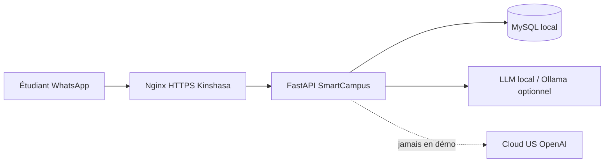

# SmartCampus AgentAI — Souveraineté des données (slide pitch)

## Message clé (30 s)

> **Les données académiques et financières des étudiants restent à Kinshasa.**  
> Hébergement local (Yamify / Texaf), base MySQL sur infrastructure congolaise, agent IA en **lecture seule** sur ERP + CRM.  
> Aucune note, aucun paiement, aucun téléphone étudiant n’est envoyé vers un LLM étranger en mode démo.

## Architecture souveraine

## Engagements techniques

| Principe | Implémentation |
|---------|----------------|
| Données au pays | MySQL + API sur serveur Yamify |
| Agent lecture seule | Pas de DELETE ; pas d’écriture notes/frais via chat |
| LLM | `DEMO_MODE=true` → templates ERP/CRM ; ou `LLM_ENDPOINT` local |
| Secrets | `.env.production` hors Git, `JWT_SECRET` fort |
| Transport | HTTPS via Nginx (reverse proxy) |

## Chiffres démo (Jean Mukendi)

- Matricule : `ETU-2026-001` · Téléphone : `+243810000001`
- Moyenne S2 : **72,5 %** · Frais : **300 000 CDF** restants (partial)

## Contact infra

**Yamify** — cloud souverain Kinshasa · OpenCampus Hackathon
